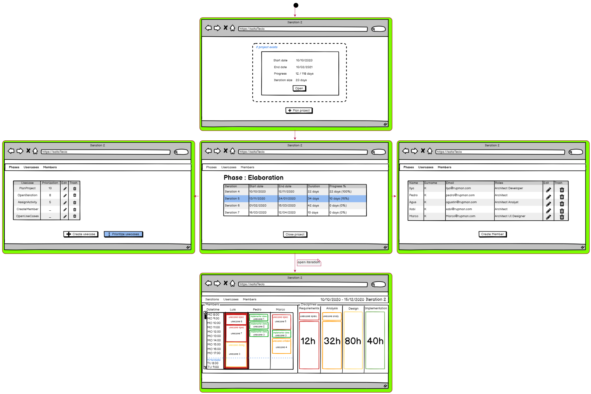

= RUP MANAGER

== Requirements

[#_index]
=== Index

* <<_UseCasesDiagram>>
* <<_ContextDiagram>>

** Specifications
*** General
**** <<_StartSystem>>
**** <<_CloseSystem>>
**** <<_PlanProject>> (comentario a revisar)
**** <<_OpenPhases>>
**** <<_OpenIterations>>

*** Disciplines
**** <<_OpenIteration>>
**** <<_AssignActivity>>
**** <<_ReEstimateActivity>>
**** <<_MergeActivity>>
**** <<_SplitActivity>>
**** <<_CloseActivity>>

*** Members
**** <<_OpenMembers>>
**** <<_CreateMember>>
**** <<_UpdateMember>>
**** <<_DeleteMember>>

*** UseCases
**** <<_OpenUseCases>>
**** <<_CreateUseCase>>
**** <<_UpdateUseCase>>
**** <<_DeleteUseCase>>
**** <<_PrioritizeUseCases>>

** Webmap
** [ ] <<_Webmap>>

[#_UseCasesDiagram]
=== Use Cases Diagram

[plantuml,align="center"]
----
include::repository/UseCases.puml[]
----

<<_index>>

[#_ContextDiagram]
=== Context diagram

[plantuml,svg,align="center"]
----
include::repository/ContextDiagram.puml[]
----

<<_index>>

[plantuml,test_link,svg,opts=interactive]

include::{docdir}/repository/specifications/general/General.adoc[]
<<_index>>
include::{docdir}/repository/specifications/disciplines/Disciplines.adoc[]
<<_index>>
include::{docdir}/repository/specifications/usecases/UseCases.adoc[]
<<_index>>
include::{docdir}/repository/specifications/members/Members.adoc[]
<<_index>>

[#_Webmap]
=== Prototype user interface

<<_index>>