= RUP MANAGER

[#_index]
== Index
* <<_disciplinaRequsitos>>
* <<_disciplinaAnalisis>>

== Modelo de dominio

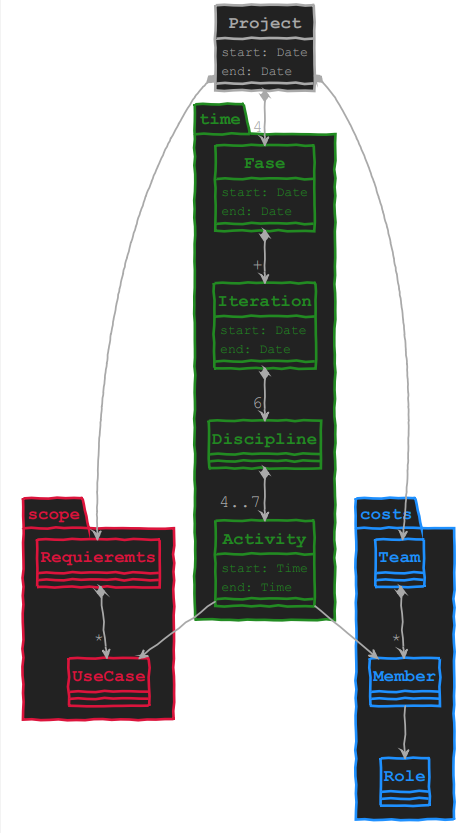
<<_index>>

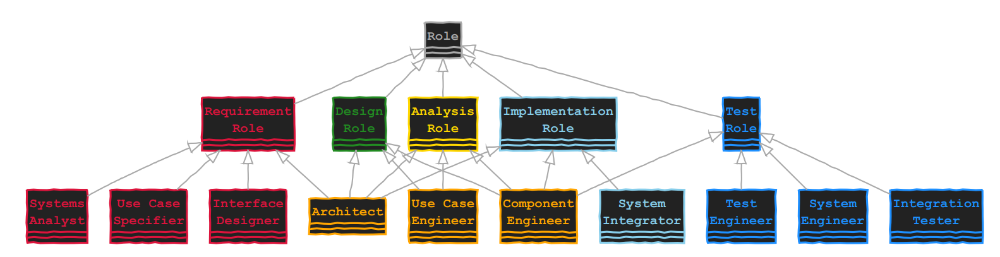
<<_index>>

[#_disciplinaRequsitos]
== Disciplina de requisitos

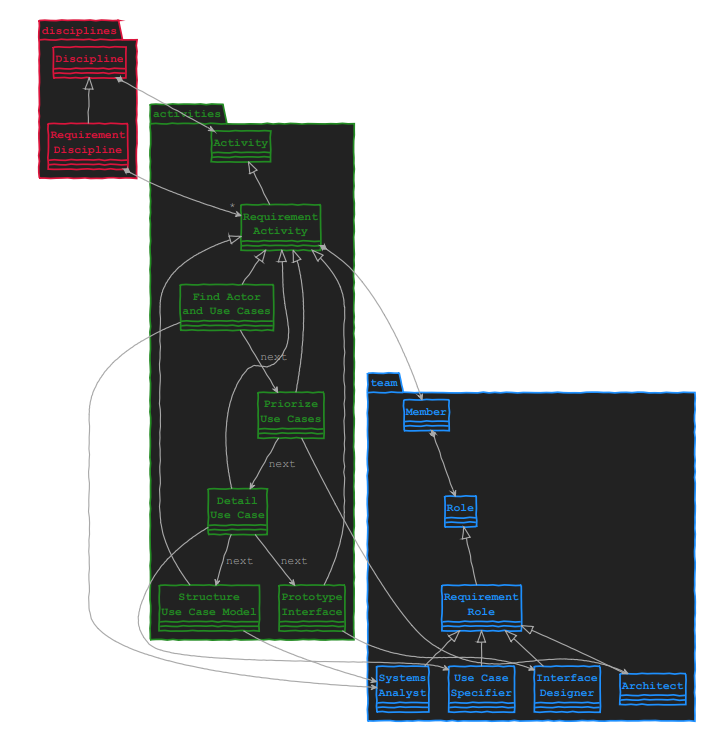

[#_disciplinaAnalisis]
== Disciplina de análisis

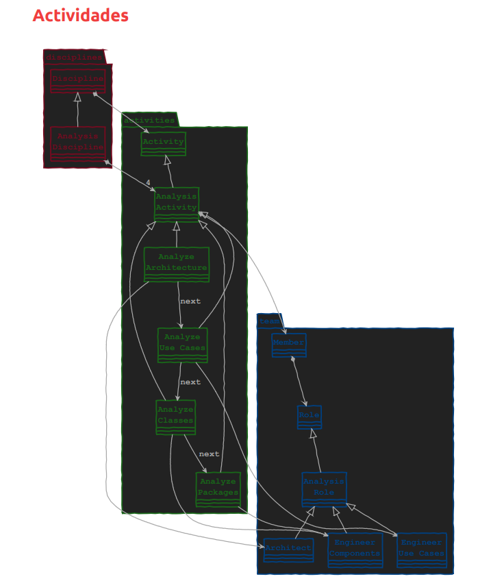

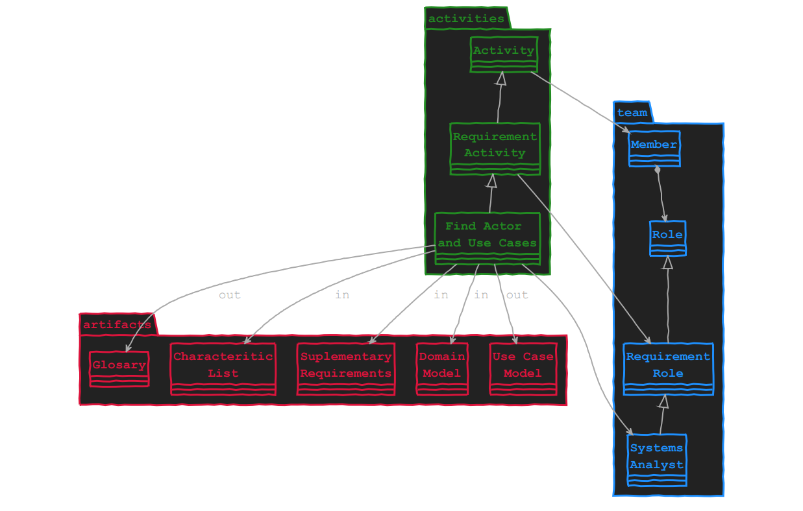
<<_index>>

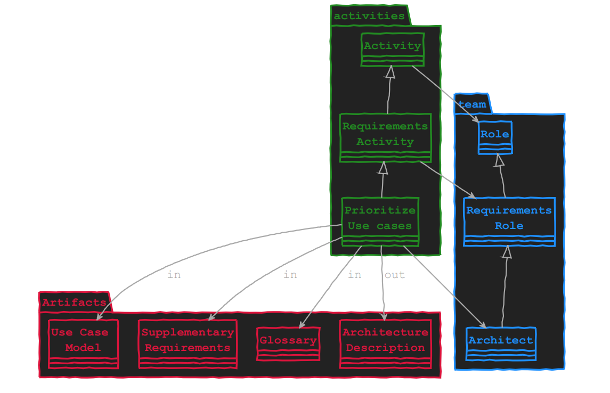
<<_index>>

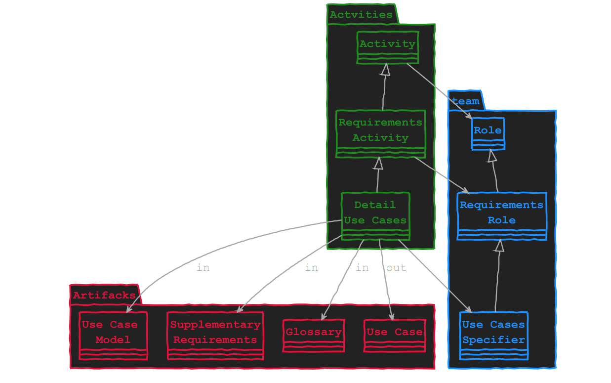
<<_index>>

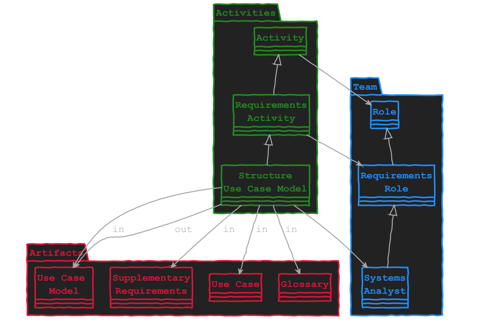
<<_index>>

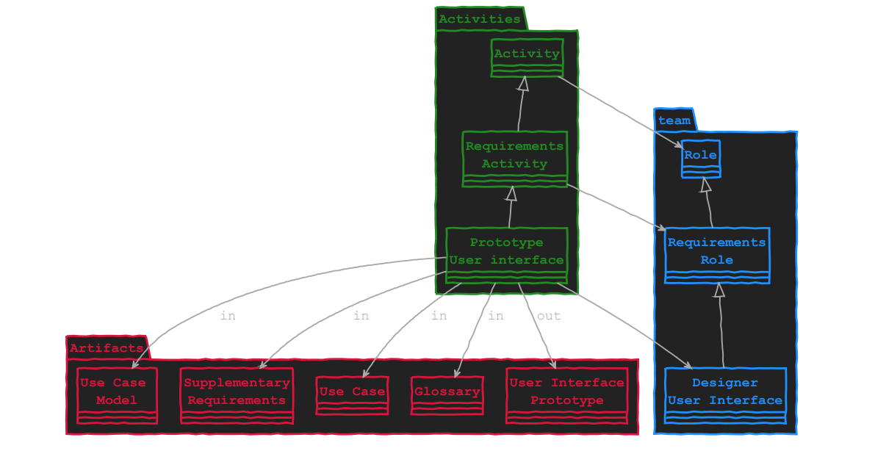
<<_index>>

=== Actividades

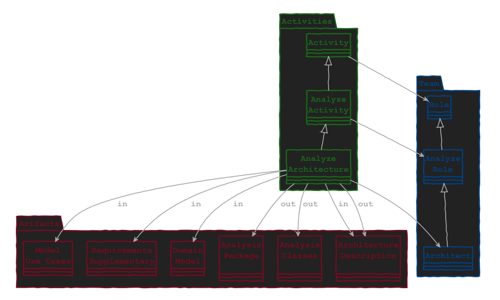
<<_index>>

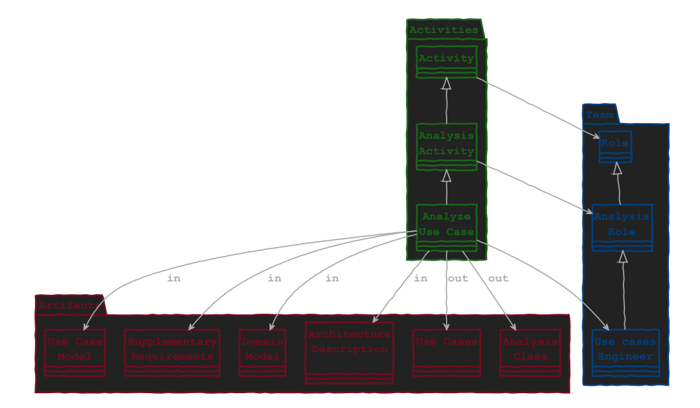
<<_index>>

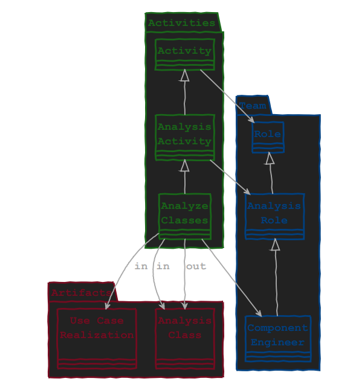
<<_index>>

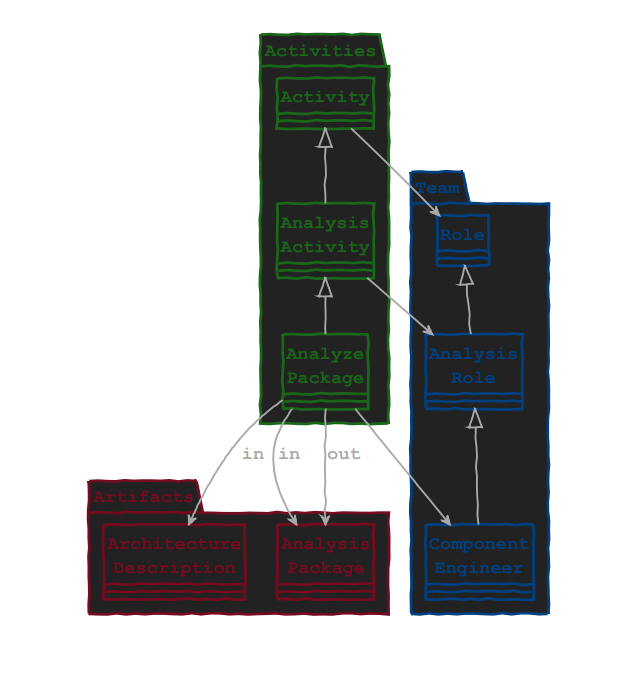
<<_index>>

